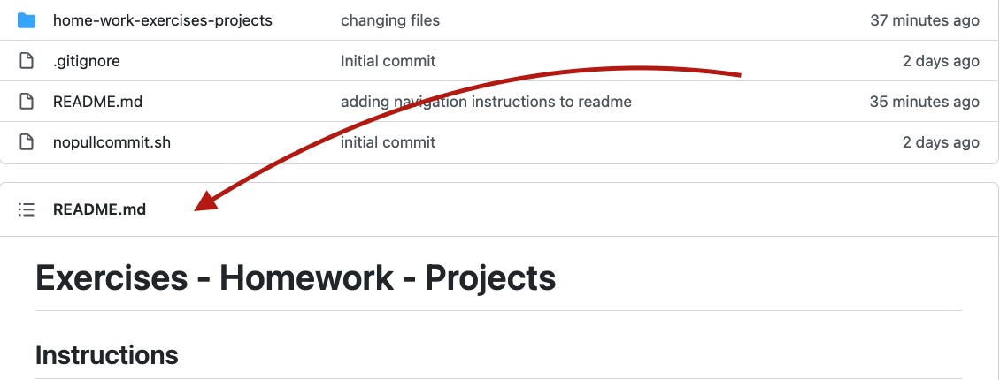
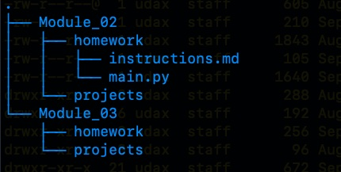

Replit has been a bit of a disappointment.  Given the unreliability of the team projects (e.g., some of you, when forking the project repl, would not also be able to fork the `instructions.md` file), I have decided to post homework, exercises, whatever in a Github repository.

Thus:

- Homework, exercises, etc., will be placed here: [Python Projects](https://github.com/multum-non-multa/python-projects)

- On that page you'll see instructions in the `README.md` file, visible below the file listing.

- In general, you'll go to the folder marked `home-work-exercises-projects`.  Within that folder you'll find modules.

- Just read the `instructions.md` on Github but ___copy___ the python files into the repl that I've designated on Replit.com

